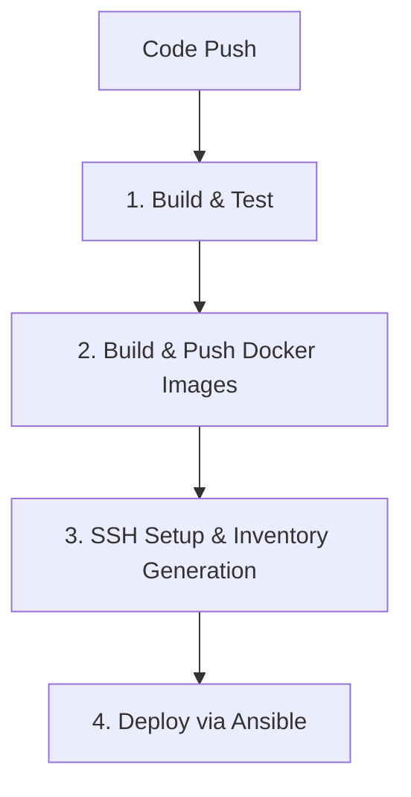

# GitHub Actions CI/CD Workflows 🚀

This directory contains the automated integration and deployment configurations that drive the GitOps delivery process of the Pasantías & Vinculación system.

---

## 📋 Available Workflows

We maintain two main deployment pipelines matching the environments:

| Workflow File | Target Branch | Target Environment | Automation Pipeline |
|---|---|---|---|
| [`deploy-qa.yml`](/file:///c:/Users/gisse/sistema-pasantias-vinculacion/.github/workflows/deploy-qa.yml) | `QA` | **QA Environment** | Builds & pushes `:qa` Docker images, deploys via Ansible on the QA EC2 instance. |
| [`deploy-prod.yml`](/file:///c:/Users/gisse/sistema-pasantias-vinculacion/.github/workflows/deploy-prod.yml) | `main` | **Production** | Builds & pushes `:latest` Docker images, deploys via Ansible on the Production EC2 instance. |

---

## 🔄 Pipeline Stages

Both pipelines follow a strict, automated 4-stage deployment flow:



### 1. Build and Test
* Configures **Java JDK 17 (Temurin)** on the runner using `actions/setup-java`.
* Leverages **Maven caching** to skip duplicate dependencies download.
* Runs test suites for all backend microservices:
  ```bash
  ./mvnw test
  ```

### 2. Build and Push Docker Images
* Authenticates to Docker Hub using secure secrets.
* Builds Docker containers for all components (`auth`, `internship`, `user`, `linkage`, `gateway`, `frontend-web`).
* Configures target gateway ports for frontend build parameters (`VITE_GATEWAY_PORT`).
* Tags and pushes the images to Docker Hub.

### 3. SSH Setup and Tunnel Configuration
* Mounts a private SSH key onto the GitHub Actions runner.
* Gathers SSH keyscans of the **Bastion Host** (public jump host) and registers it to `known_hosts`.
* Dynamically writes an Ansible Inventory file configuring a secure SSH tunnel proxy command:
  ```ini
  [qa_ec2]
  <PRIVATE_IP> ansible_user=ubuntu ansible_ssh_private_key_file=~/.ssh/QA.pem ansible_ssh_common_args='-o ProxyCommand="ssh -W %h:%p -i ~/.ssh/QA.pem ubuntu@<BASTION_IP>"'
  ```

### 4. Deploy via Ansible
* Installs Ansible on the runner environment.
* Invokes `ansible-playbook` targeting the private EC2 instance inside the AWS private subnet.

---

## 🔒 Required GitHub Secrets

To run the workflows successfully, the following GitHub Secrets must be populated in the repository settings:

### General Secrets
* `DOCKERHUB_USERNAME`: Docker Hub container registry username.
* `DOCKERHUB_TOKEN`: Personal access token for Docker Hub push permissions.

### QA Environment Secrets
* `QA_SSH_KEY`: Private key (`.pem`) used to authenticate into Bastion and QA EC2 instances.
* `QA_BASTION_IP`: Public IP of the QA Bastion host.
* `QA_AUTH_JOBS_IP`: Private IP of the QA services EC2 instance.

### Production Environment Secrets
* `PROD_SSH_KEY`: Private key (`.pem`) used to authenticate into Bastion and Prod EC2 instances.
* `PROD_BASTION_IP`: Public IP of the Production Bastion host.
* `PROD_AUTH_JOBS_IP`: Private IP of the Production services EC2 instance.
